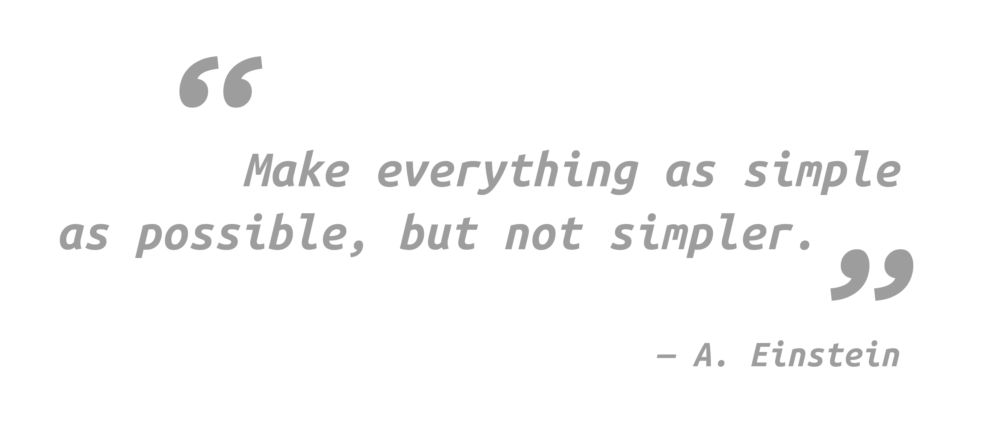

## Welcome on my profile! 👋

 

<h5 align="center">
  <code>
    <a href="https://www.linkedin.com/in/giuseppemurro/" title="LinkedIn Profile"> LinkedIn</a></code>
  <code><a href="https://stackoverflow.com/users/14789272/giuseppe-murro" title="Stack Overflow Profile"> Stack Overflow</a></code>
  <code><a href="https://www.instagram.com/giuseppemurro/" title="Instagram Profile"> Instagram</a></code>
</h5>
 

<h2 align="center">Languages & Frameworks & Tools & Abilities</h2>

  <code></code>
  <code></code>
  <code></code>
  <code></code>
  <code></code>
  <code></code>
  <code></code>
  <code></code>
  <code></code>
  <code></code>
  <code></code>
  <code></code>
  <code></code>
   <code></code>
  <code></code>

  
  

Feel free to reach out to say hi:

- 
- 
- 
- 

::if ctx.theme == “dark”

::else

<!--
**gmurro/gmurro** is a ✨ _special_ ✨ repository because its `README.md` (this file) appears on your GitHub profile.

Here are some ideas to get you started:

- 🔭 I’m currently working on ...
- 🌱 I’m currently learning ...
- 👯 I’m looking to collaborate on ...
- 🤔 I’m looking for help with ...
- 💬 Ask me about ...
- 📫 How to reach me: ...
- 😄 Pronouns: ...
- ⚡ Fun fact: ...
-->
